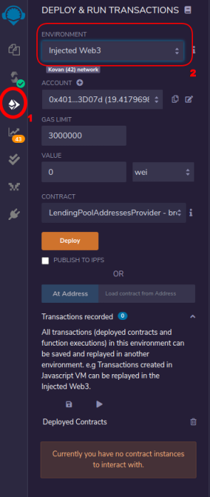
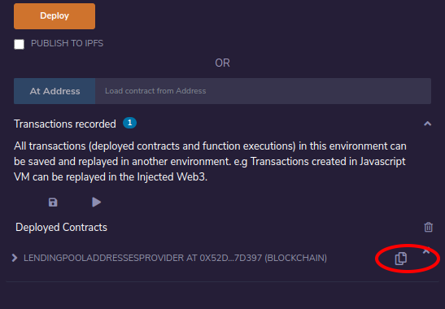
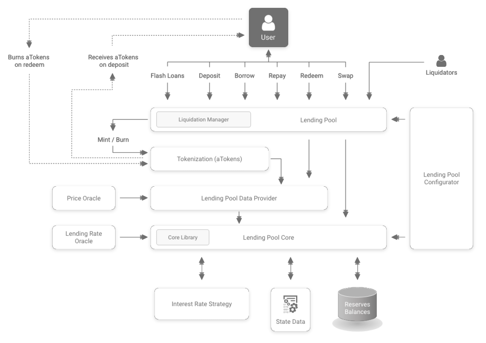
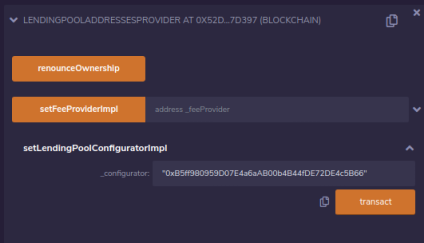
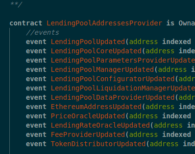

# Importing into Remix

1. You'll need to create a blank file in Remix. This allows you to add directories
2. Create all the top level directories and treat the node dependecies like openzeppelin-solidity as a top level contract
  For instance, the contracts often import "openzeppelin....". Change this to "./openzeppelin..." then create a directory in remix with that name and copy accross everything from the node_modules
3. Add the subdirectories to your main directors. At this point you shouldn't have added any code.
4. Add the files and copy in the code.
5. Remember to change the openzeppelin-solidity import references to use relative paths.
6. Compile each file to check that you've imported correctly. 
   ->pro tip: when you get an error about a contract having already been declared, look at the import above the offending line. Go to that file. One of the imports in this file has an incorrect path

# Deploying to Kovan from remix
The first step to deploying is to find the innermost contract in the Aave architecture. In Aave there's a contract registry that is deployed once. All the contracts reference this registry contract to retrieve the correct versions of their dependencies.

To deploy, click on the deploy menu option (1) and set Environment to Injected Web3 (2). This will prompt your metamask to connect to Remix.




Deploy LendingPoolAddressesProvider.sol:
Your deployed contract will be displayed in a list. 





Click the copy icon to retrieve the address. Don't worry about ABIs. The repository has them already.

  **Note: all deployments are happening from 0x4011Ba13ACD2E078B0234C125D04e5C61803D07d. Since many of these contracts are owned, ownership transfer will have to occur at some point. In addition to the owner, the contracts have a role LendingPoolManager. This is a human controlled account that has authority to control vital actions at the core of the protocol.**


```
 LendingPoolAddressesProvider Kovan address: 
 0x1a84C655a3F178BeA02DcBc9F46Bc84c17c36FC0
```

Next we should look at all the expected contracts in LendingpoolAddressesProvider and deploy them and their dependencies.
We'd have to start with their dependencies first. The best dependencies to start with are those that have none. The diagram below is the core architecture of the Aave smart contracts:



let's start the LendingPoolConfigurator. This contract was written before EIP-170 which sets an upper limit on contract size. To get around this, we set Remix to optimize compile.

We initially get an address for LendingPoolConfigurator. We inform LendingPoolAddress provider of its existence by calling the set function for Configurator. This spawns a new proxy contract. If we call LendingPoolAddressProvider.getLendingPoolConfigurator, we now get a new address. This is the configurator address in the system.

```
LendingPoolConfigurator: 0xF1bEF1a345371716B607590003f2aBC180C7036C
```

Following the steps above, 

```
LendingPoolParametersProvider: 0x71B78196dFB678A6B796AfaBFe629a1A42BCD32d
```

We'll continue to deploy and initialize all the contracts listed at the top of lendingPoolAddressProvider. Note that some of the contracts aren't wrapped in proxies so the address won't change on set. 

```
LendingPool: 0x667091e8c1FA63977C1Ce99Ae5653Af677C17655
LendingPoolCore: 0x6444Bff5143F4722A47877774A39dD9250D529A5
LendingPoolConfigurator: 0xF1bEF1a345371716B607590003f2aBC180C7036C
LendingPoolParametersProvider: 0x71B78196dFB678A6B796AfaBFe629a1A42BCD32d
LendingPoolManager: this is a wallet address (preferably multisig). For simplicity, I've set it to your address
LendingPoolLiquidationManager: 0xb0A659f600Ef834BA2c172EA790243bCAbe098ed
LendingPoolDataProvider: 0x9e5d3229359eB3640D60066cBb1de83F216158CE
EthereumAddress - unused in this contract
PriceOracle -> first deployed the provided mock PriceOracle: 0x31DAe81A5c6C435f8d7d43990822775181bA1403
LendingRateOracle: 0xDF9DD372dfd530972e776E91b4C9baD7d334F741
FeeProvider: 0xdd42eb4633aAE0609f72D8163edDa309f2E0f4c6
TokenDistributor: 0x8b48d8eE7B81988df5321f62a73Cb0AaD2B1F412
```
Note on the price oracle: I've given arbitrary values for the ETHUSD and Kovan Dai price so that zero isn't returned. Once the reserves are deployed, you can update for each token

We then add the addresses for all the mock contracts
First the MockAggregators
```
BAT: 0x2D49d05B28533365F24E0FA0FF481A18C8178c32
DAI: 0xA9B6E1f006163FB07698071b4B5a9cf13542d1eA
KNC: 0x3fcB24dC871e7318905947272A26E9b1f9F1B944
LEND: 0x17b8DABd83a0140e70D96D0733C64645A2B5CdbF
LINK: 0xAA6ceA3E84A2717035b9644f9Ff54C74D51259C6
MANA: 0xa5104818BB8D9a2023f0BbEE039f9dFaA26284F2
MKR: 0xEbA960fe41A32E52D32C77c34fE5971712FD3a3e
REP: 0x7031F74E8cCe0Ec2c8BfB5Fec688bD6ccb810B26
SUSD: 0x07136Ccc2e89264ECbed87397eA863389fC01DFD
TUSD: 0xEd1ec66F1246243861aEE307060C5baEbBbd4fB7
USDC: 0xFd1f4747cBfbBb1E5bE7f290dfeD4b5BD3C4477b
USDT: 0x1571f7693152086588A63b04a92AaF4A3c70ab4d
WBTC: 0x5968451B5Bff8fbD5446C71172450302880Dd95c
ZRX: 0xFf00975111a045099B3A13610DA9Da1842b8D491
```

Then Flashloans:

```
MockFlashLoanReceiver: 0x792c2aadB101Ee3C3F3D9487F2E899DdE8A34e27
```

The LendingPoolcore links to a library called the core library. a library is a stateless contract that provides helper functions. A very common library in use is OpenZeppelin's SafeMath which provides basic arithmetic functions that don't allow unsigned integer under- or overflows

```
CoreLibrary: 0x98Bc70e12eCd10Bf7dd52c27003703A6F96bBFF5
```
## Aave terminology
When an ERC20 token is added to Aave for deposits and loans, it is referred to as a reserve. Each reserve requires it's own ReserveInterestRateStrategy contract.
This contract informs Aave how to set borrowing and savings rates. I've deployed one for the Kovan Dai token as an example:

```
ReserveInterestRateStrategy for Dai: 0x2963bF52c63935CDa43aD774e1E2B126A81594FE
Kovan Dai: 0xc4375b7de8af5a38a93548eb8453a498222c4ff2
```

# Reserve initialization
To begin using Aave, we have to initialize the reserves so that deposits, borrows and liquidations can occur.
This section outlines the process adding an asset as a reserve. Only a LendingPoolManager account can add a reserve to the system.

### InterestRateStrategy
Each reserve has a corresponding contract that determines the interest rate strategy for that reserve. Before initializing the reserves, we need to deploy this InterestRateStrategyContract for each reserve. Take note that the interest rate fields are expressed in RAY units. 1 RAY is equal to 10^27. S if you want to set an interest rate of 20% then you'll supply the value of 0.2*10^27 as the parameter value.

### Lending Rate and Price Oracles
While oracles should be updated in real time, it won't hurt to initialize them with non-zero values for each asset for debugging purposes. The Lending Rate values are RAY but the price values are WAD. 1 WAD = 10^18, the same precision as Ether and most ERC20 tokens. Bear in mind that on mainnet WBTC has 8 decimal places.

## Initialize Reserve
The LendingPoolConfigurator provides a method to initialize a reserve. In the process, the corresponding AToken is deployed. LendingPoolCore provides getReservATokenAddress which takes the base token as the sole parameter. After initializing, the following AToken addresses were retrieved:

```
ABAT: 0x07A9B5280Ca782D413B4f10Cd5dce82b1Df6977d
ADAI: 0x3b6F3dcdE173313BE7A0C731cD3ebb0753f3d95B
AKNC: 0x6F019886434A0EDC960f904f85d1CDCdbD071aca
ALEND: 0x8b73dc25B7707d7605f1Deb252274c2A68f62da5
ALINK: 0x72067d0b07E9FB76951382c3458382F544f4D330
AMANA: 0x65191a21D93F85480CF5889c8a1428D005203539
AMKR: 0xcC95c7F4B4aBc541459B8cB4E88368FCeF719f9D
AREP: 0x211774E88823fB1D4bf36933eA4D39E77a158e89
ASUSD: 0xAac86835b989728d4cbB100673B6A2a477ABD401
ATUSD: 0xB7779F400A8b16E512d916C31D0BEdDA7d0E9a78
AUSDC: 0x030D7203C27D416d929A1361Effda4fa86B62303
AUSDT: 0x4dF4aaC4999EaBEd7219DB6f9a4C802C355Cf786
AWBTC: 0x9fcAb70F66af54ec1bf541D05ba73B45B677f132
AZRX: 0x7C084B11d7Ed6439bEC860a1FAeE4ee3152B1E21
```

### Mint reserve tokens for user
The next task would be to mint some token to deposit. In remix, you can deploy a contract to an existing address. Recompile a mock token such as MockDAI and paste the existing MockDai address in the at textbox. Then mint an amount to deposit.

The mock token addresses are:

```
MockBAT": "0x719d113f2c0D11f9797c3BC8D261323820c2132e
MockDAI": "0x6DCBFbcd99D7b989De348aC06c8944Aa4738192a
MockKNC": "0x1E8e017fe09d8D0c652458822Bc87e46Ca3e42Ea
MockLEND": "0xb6b225BD0F0506CF431EA492e90fBfD58589d6D5
MockLINK": "0x5318CDd1D39005fCFDbc8Ca6662C1074A83119dD
MockMANA": "0x5429A60B8fC7E2002840eA789ebD94FC253e102A
MockMKR": "0xEc218Ca1D57c7aB9ae2a238D9BE7B97e807DAd6B
MockREP": "0x17250e05D879670c1d7aF055A287Dd46b1cc6c88
MockSUSD": "0xfC387B2522D80CF163b84B36E14AfCa80409b5a4
MockTUSD": "0x1784e824fE8CFCA87719fB183273948BdD99CA0B
MockUSDC": "0x450b5e24067d717e52Ab40990Fb9Ff7c48c4Ea98
MockUSDT": "0x29FA0d0d781Ecc5A40294Aac5B7aC28011f285c7
MockWBTC": "0x71F90B8a9540e73B8Ca1E4eEd143de694A78ABE1
MockZRX": "0x42Df5A2E1b0Be4CA0936dDD5d73A8c29D7b90335
```

### Activate Reserves
Before actions on a reserve can happen, they have to be activated. LendingPoolConfigurator has the activateReserve function.

### Enable Borrowing
LendingPoolConfigurator is required once more to enable borrowing on the reserve.
LendingPoolCore is required to enable the reserve to be used as collateral

## ERC20.Approve
If the token is not eth, you first have to approve the LendingPoolCore address before depositing. The address can be retrieved from the LendingPoolAddressesProvider. 

